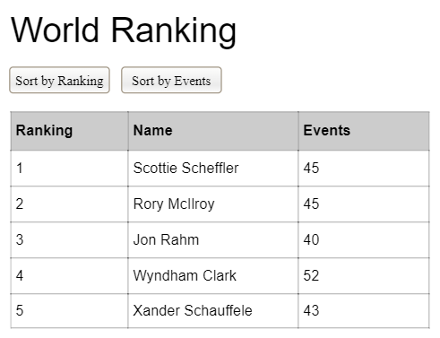

Golf Data project
=================

This is a mini-project allowing you to learn a bit of JavaScript (or other languages) by creating a way to view and
sort/filter some simple data.

# Starting out

Have a look at the [site/data/ranking.json](site/data/ranking.json) file and see what data there is.

It has some metadata, and then a list of rankings with some additional data for each person.

# Project ideas

## You could just list all the data

## You could create a table

## You could make it sortable

## Or filterable too!

# Credits

Thanks to the golf API at https://rapidapi.com/sportcontentapi/api/golf-leaderboard-data for the data

